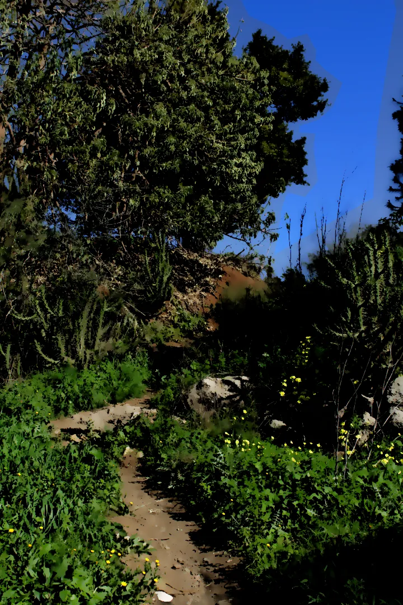

# [:uk:](README_EN.md)   [:de:](README_DE.md)   [:fr:](README_FR.md)
# Comic pages filter
### 📝 Descripción
Este es un plugin escrito en Python-Fu para GIMP 3.0. Automatiza un flujo de trabajo específico de edición de imagen realizando los siguientes pasos con un solo clic:
* Copia la capa base y aplica el efecto de Óleo (GEGL Oilify).
* Crea una segunda copia de la capa y cambia su modo de fusión a Multiplicar.
* Crea una tercera copia, la desatura (modo luminosidad), la pone en modo Multiplicar y le aplica un filtro de Umbral.
|  |   
| --- | --- | 
|  |  | 
| Fotografía sin editar | Fotografía editada | 

### ⚙️ Instalación
1. Copia el archivo `gimp-tutorial-plug-in.py` en tu directorio de plugins de GIMP 3 (por ejemplo: `~/.config/GIMP/3.0/plug-ins/`).
2. Asegúrate de que el archivo tenga permisos de ejecución (en Linux/macOS: `chmod +x gimp-tutorial-plug-in.py`).
3. Reinicia GIMP.

### 🚀 Uso
1. Abre cualquier imagen en GIMP.
2. En el menú superior, navega hasta **Filtros > Automatization**.
3. ¡Disfruta del resultado!
